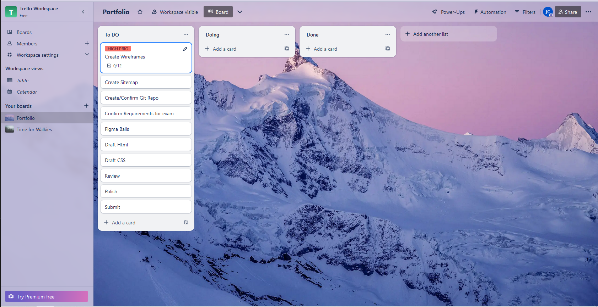
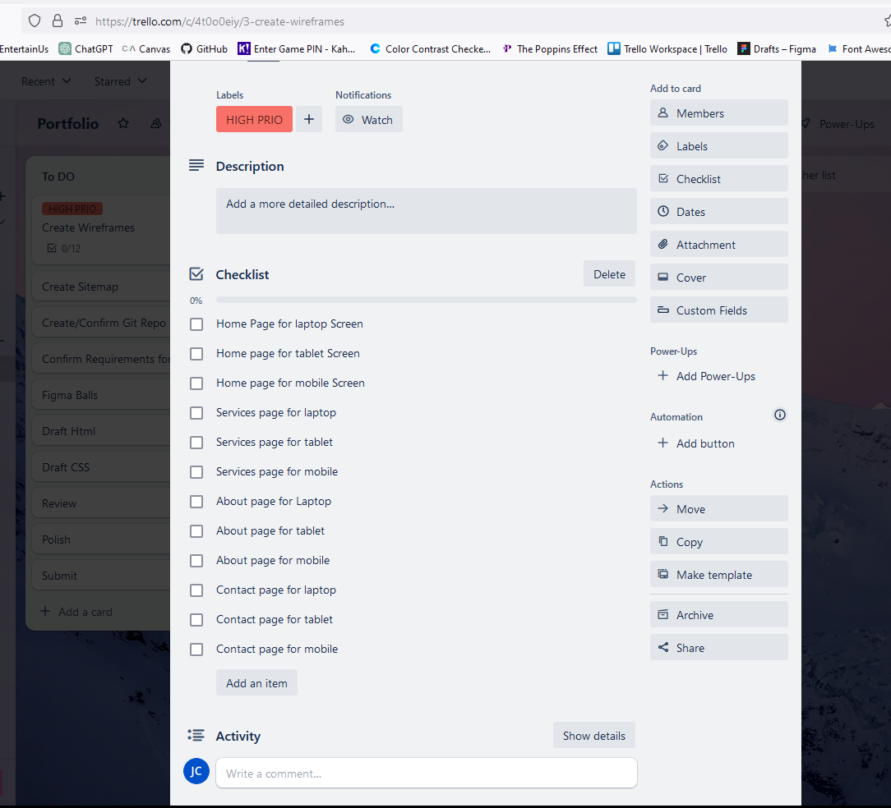
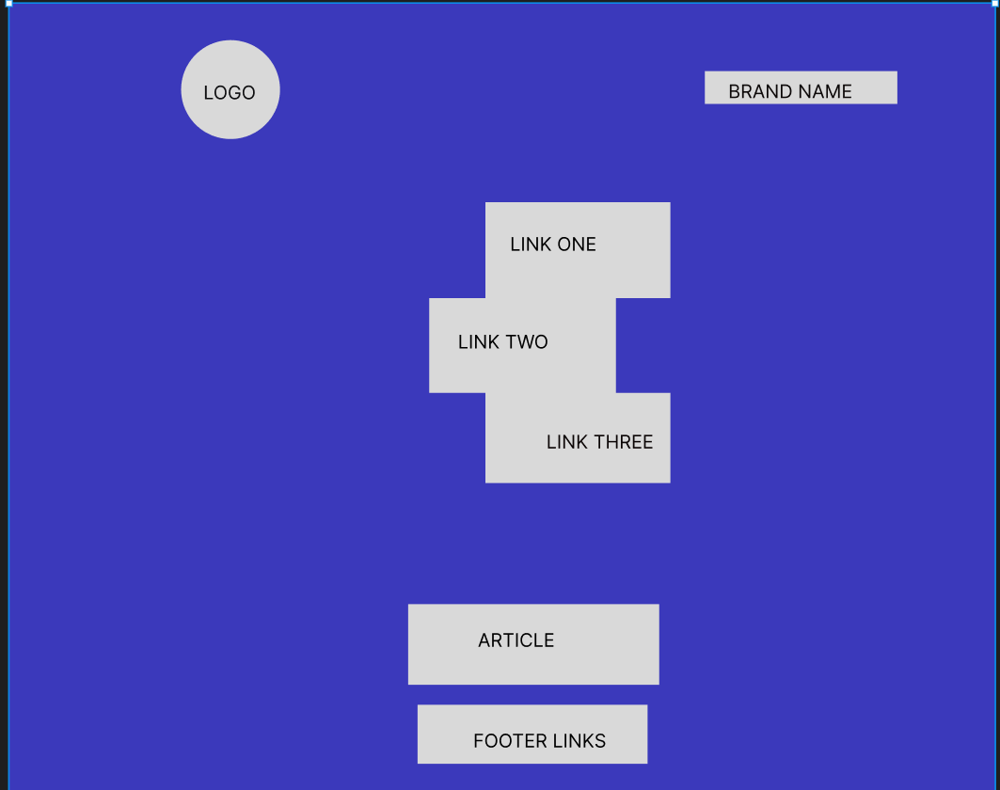
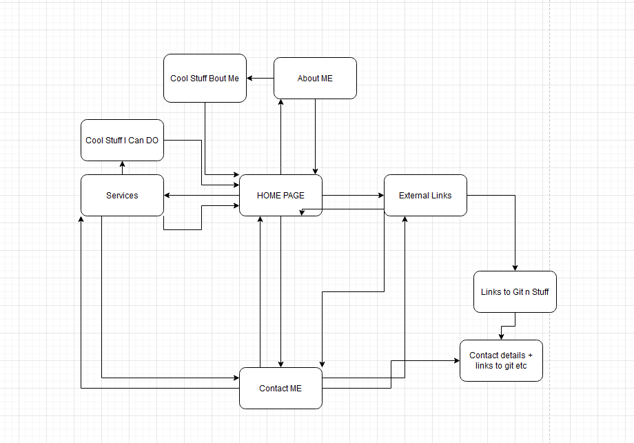

# Portfolio
- Commenced Developing my portfolio website with rough Kanban and wireframing

### My first Trello

### It probably needs a bit more work to sell it, but at least I have an idea of what to have as an idea
- Work in progress*

### Using Figma for sitemap and planning
- The idea is to have a dynamic desktop website with slide ins n outs
    - The mobile version will be slimmed out and less visual impact by using more static imagery while retaining the (hopeful) class and overall styling of the larger versions
    - 

### Using Drawio to do a rough wireframe
    

### Commenced HTML and CSS
- Added Favicon, set up style links, created image, page, and styles folders
- Researched and set Main and Secondary Colours in :root 
- Researched and set fonts
- Created custom images for links
- Setup ids for links to facilitate animation

### Deployed to Netlify
- Initial deploy succesful
- Updated htmls, added blog.html and updated links
- Deploy error. Plx save me.
- Updated styling on images
- Stumped for the moment on deploy errors

### Stylised Index.html
- Added animation and box shadows to image links
- Added copyright symbol to footer and altered colour &#169;

### Added External links to footer
- Github
- LinkedIn
- Blog

### Created Blog.html, Updated css and created seperate sheet for services

### Polished Different Media styles and quality tested
- Found about 12 major issues, resolved.

### Created about styles, contact styles and optimised for resonsive design
- Further optimisation of each stylesheet.

### Built Basic Blog 
- Setup for refining

