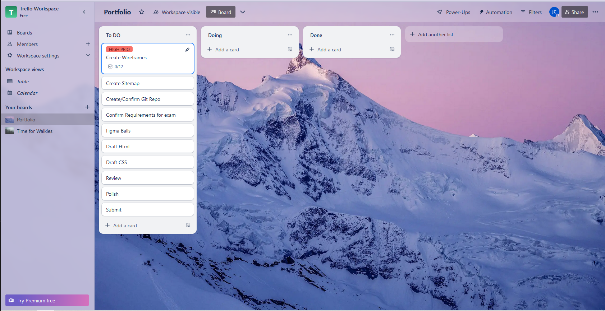
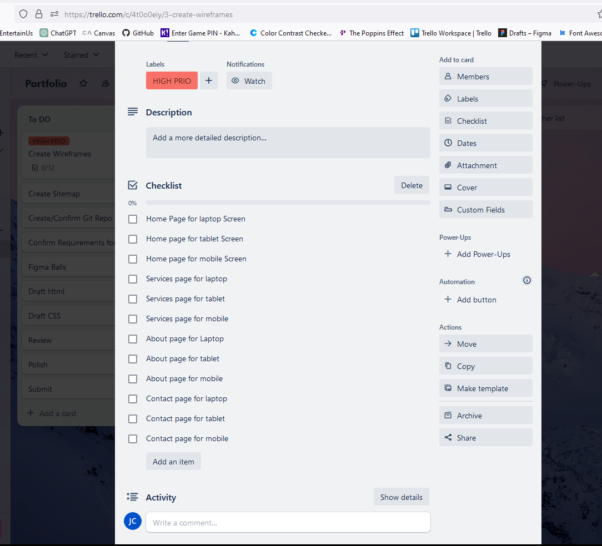
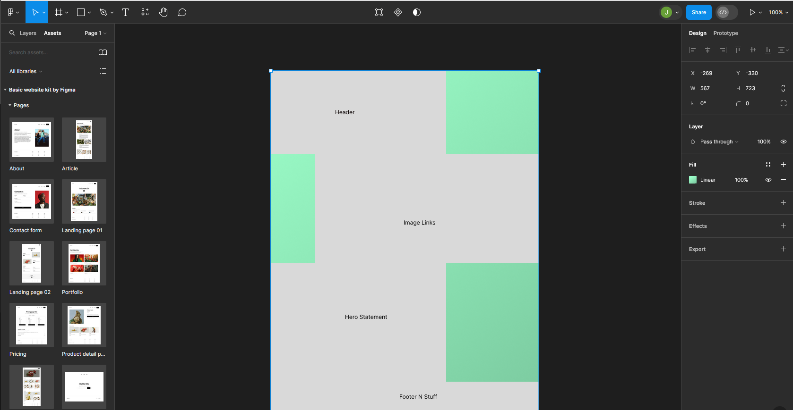
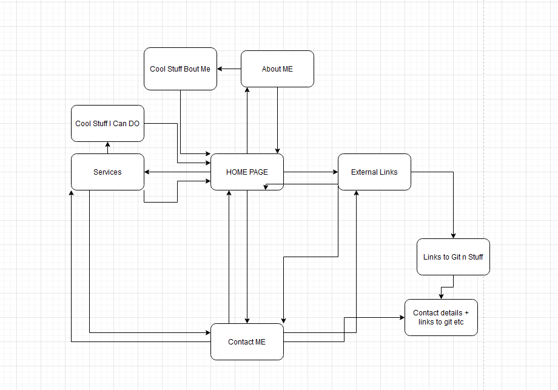

# Portfolio
- Commenced Developing my portfolio website with rough Kanban and wireframing

### My first Trello

### It probably needs a bit more work to sell it, but at least I have an idea of what to have as an idea
- Work in progress*

### Using Figma for sitemap and planning
- The idea is to have a dynamic desktop website with slide ins n outs
    - The mobile version will be slimmed out and less visual impact by using more static imagery while retaining the (hopeful) class and overall styling of the larger versions
    - 

### Using Drawio to do a rough wireframe
    