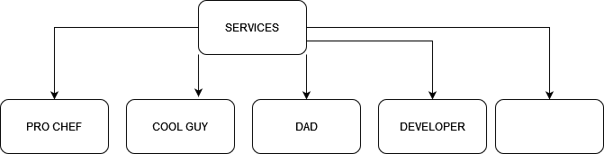

# Portfolio
- [My Github](https://github.com/JohnColeborn/Portfolio)
- [My LinkedIn](https://www.linkedin.com/in/john-coleborn-248692288)
- [My Portfolio Website on Netlify](https://johncoleborn.netlify.app/)

### TLDR
- This is a trial website built purely to showcase my current learning
- It is built predominantly with HTML and CSS, and a tiny pinch of JavaScript
- I built it using VS Code, WSL Ubuntu, Github and caffiene, deployed it using Netlify, and also made use of Trello, Figma, Drawio, and other misc tools such as constrast checkers and font style optimisers.
- It has a mix of real content and lorem, and utilizes responsive layout, animations, and a few other tricks. (Find the easter egg)
- This is targeted at potential employers, grading teachers, anyone I can brag to really

### My first Trello
- [Found Here](https://trello.com/b/qKVtsi19/portfolio)

### Using Figma for sitemap and planning
- The idea is to have a dynamic desktop website with sliding animations, high visual impact and subtle use of lighting and contrasts to impact viewers
    - The mobile version will be slimmed out and less visual impact by using more static imagery while retaining the (hopeful) class and overall styling of the larger versions.
    - The concept is minimalist elegance with a touch of flippancy.
    - Using various shades of blue to highlight and draw focal points at particular points
    - Using consistent imagery, themes, fonts, and more specifically branding to purvey both the intent of the content and also the efficacy of it's selling points. EG: Using highlights and shadows to draw people to checking out the links and wanting to see and know more.
    - 

### Using Drawio for Wireframes / Sitemap
- Through a simple design and clean consistent links navigation will be achieved through the navbar at the top, the image/text links throughout the body, and to external links in the footer

- 
- -  
- - - 
- -  

